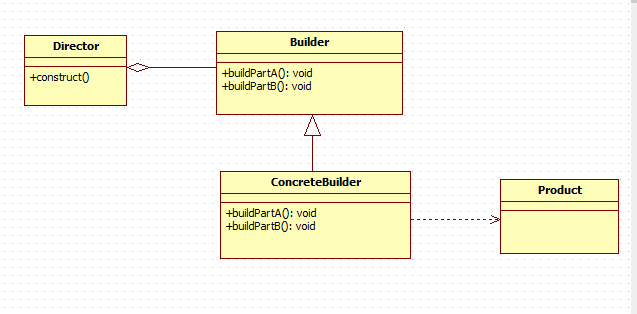

# 建造者模式 - Builder Pattern

## 一、建造者模式的定义与特点 

### 定义:
**​建造者模式(Builder Pattern)**：创建者模式又叫建造者模式，是将一个复杂的对象的构建与它的表示分离，使得同样的构建过程可以创建不同的表示。创建者模式隐藏了复杂对象的创建过程，它把复杂对象的创建过程加以抽象，通过子类继承或者重载的方式，动态的创建具有复合属性的对象。

## 二、应用场景
- 隔离复杂对象的创建和使用，相同的方法，不同执行顺序，产生不同事件结果    
- 多个部件都可以装配到一个对象中，但产生的运行结果不相同  
- 产品类非常复杂或者产品类因为调用顺序不同而产生不同作用  
- 初始化一个对象时，参数过多，或者很多参数具有默认值  
- Builder模式不适合创建差异性很大的产品类。产品内部变化复杂，会导致需要定义很多具体建造者类实现变化，增加项目中类的数量，增加系统的理解难度和运行成本  
- 需要生成的产品对象有复杂的内部结构，这些产品对象具备共性；  

 

## 三、结构(UML类图)与说明
***建造者模式分为两种：***
- 经典模式
- 变种模式      

经典建造者模式一般不常用，变种模式是经常写的模式，以下我根据一个场景分别来分别介绍一下。

### 经典建造者模式
经典Builder模式UML图，如图1所示。

    
    
图1 经典建造者模式结构图

## 四、单例模式有哪些?

## 五、可能会遇到哪些坑?

## 参考：
- https://www.jianshu.com/p/3d1c9ffb0a28
- https://www.jianshu.com/p/afe090b2e19c
- https://www.cnblogs.com/yc211/p/7701049.html