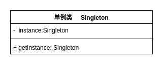

# 单例模式 - Singleton Pattern

## 一、单例模式的定义与特点 

### 定义:
**​单例模式(Singleton Pattern)**：确保某一个类只有一个实例，而且自行实例化并向整个系统提供这个实例，这个类称为单例类，它提供全局访问的方法。 单例模式是一种对象创建型模式。 

### 要点：
1. 实例唯一性
2. 自行创建
3. 全局访问

### 优势：
1. 在单例模式中，活动的单例只有一个实例，对单例类的所有实例化得到的都是相同的一个实例。这样就 防止其它对象对自己的实例化，确保所有的对象都访问一个实例 
2. 单例模式具有一定的伸缩性，类自己来控制实例化进程，类就在改变实例化进程上有相应的伸缩性。 
3. 提供了对唯一实例的受控访问。 
4. 由于在系统内存中只存在一个对象，因此可以 节约系统资源，当 需要频繁创建和销毁的对象时单例模式无疑可以提高系统的性能。 
5. 允许可变数目的实例。 
6. 避免对共享资源的多重占用。

### 劣势：
1. 不适用于变化的对象，如果同一类型的对象总是要在不同的用例场景发生变化，单例就会引起数据的错误，不能保存彼此的状态。 
2. 由于单利模式中没有抽象层，因此单例类的扩展有很大的困难。 
3. 单例类的职责过重，在一定程度上违背了“单一职责原则”。 
4. 滥用单例将带来一些负面问题，如为了节省资源将数据库连接池对象设计为的单例类，可能会导致共享连接池对象的程序过多而出现连接池溢出；如果实例化的对象长时间不被利用，系统会认为是垃圾而被回收，这将导致对象状态的丢失。 

<br>

## 二、应用场景
单例模式只允许创建一个对象，因此节省内存，加快对象访问速度，因此对象需要被公用的场合适合使用，如多个模块使用同一个数据源连接对象等等。如：  
1. 需要频繁实例化然后销毁的对象。    
2. 创建对象时耗时过多或者耗资源过多，但又经常用到的对象。    
3. 有状态的工具类对象。  
4. 频繁访问数据库或文件的对象。

以下都是单例模式的经典使用场景：    
1. 资源共享的情况下，避免由于资源操作时导致的性能或损耗等。如上述中的日志文件，应用配置。    
2. 控制资源的情况下，方便资源之间的互相通信。如线程池等。 

应用场景举例：  
1. 外部资源：每台计算机有若干个打印机，但只能有一个PrinterSpooler，以避免两个打印作业同时输出到打印机。内部资源：大多数软件都有一个（或多个）属性文件存放系统配置，这样的系统应该有一个对象管理这些属性文件  
2. Windows的Task Manager（任务管理器）就是很典型的单例模式（这个很熟悉吧），想想看，是不是呢，你能打开两个windows task manager吗？ 不信你自己试试看哦~  
3. windows的Recycle Bin（回收站）也是典型的单例应用。在整个系统运行过程中，回收站一直维护着仅有的一个实例。     
4. 网站的计数器，一般也是采用单例模式实现，否则难以同步。    
5. 应用程序的日志应用，一般都何用单例模式实现，这一般是由于共享的日志文件一直处于打开状态，因为只能有一个实例去操作，否则内容不好追加。 
6. Web应用的配置对象的读取，一般也应用单例模式，这个是由于配置文件是共享的资源。    
7. 数据库连接池的设计一般也是采用单例模式，因为数据库连接是一种数据库资源。数据库软件系统中使用数据库连接池，主要是节省打开或者关闭数据库连接所引起的效率损耗，这种效率上的损耗还是非常昂贵的，因为何用单例模式来维护，就可以大大降低这种损耗。     
8. 多线程的线程池的设计一般也是采用单例模式，这是由于线程池要方便对池中的线程进行控制。       
9. 操作系统的文件系统，也是大的单例模式实现的具体例子，一个操作系统只能有一个文件系统。     
10. HttpApplication 也是单位例的典型应用。熟悉ASP.Net(IIS)的整个请求生命周期的人应该知道HttpApplication也是单例模式，所有的HttpModule都共享一个HttpApplication实例.     

<br>

## 三、结构(UML类图)与说明
**单例模式**是设计模式中最简单的模式之一。通常，普通类的构造函数是公有的，外部类可以通过“new 构造函数()”来生成多个实例。但是，如果将类的构造函数设为私有的，外部类就无法调用该构造函数，也就无法生成多个实例。这时该类自身必须定义一个静态私有实例，并向外提供一个静态的公有函数用于创建或获取该静态私有实例。

### 单例模式的结构
单例模式的主要角色如下:
- 单例类：包含一个实例且能自行创建这个实例的类。
- 访问类：使用单例的类。

其*结构*如图 1 所示。
<div align=center>
    
    <div>图1 单例模式的结构图</div>
</div>

单例模式的类图看起来很简单，一个私有的当前类型的成员变量，一个私有的构造方法，一个 getInstance 方法，创建对象不再通过new 而通过 getInstance 让该类自行创建。相信我们大多数人使用的单例模式都是这种，因为太简单了。但是单例模式的写法可不止这一种。接下来我们一起来看一下单例模式的九种写法。

<br>

## 四、单例模式有哪些?
目前单例模式主要有以下9种(基本把网上的都总结了一下,很全):
- 懒汉模式（线程不安全）
- 线程安全的懒汉模式（线程安全）
- 饿汉模式（线程安全）
- 静态类内部加载（线程安全）
- 枚举方法（线程安全）
- 双重校验锁法（通常线程安全，低概率不安全）
- 第七种终极版 （volatile + 双重校验锁）
- 使用ThreadLocal实现单例模式（线程安全）
- 使用CAS锁实现（线程安全）


### 具体介绍

#### *以下单例类（枚举方法除外）的统一使用方式都为：*
```java
public class Hello {
   public static void main(String[] args){
        SingletonDemo.getInstance().otherMethods();
    }
}
```
   

#### 1. 懒汉模式（线程不安全）
```java
public class SingletonDemo {
    private static SingletonDemo instance;
    private SingletonDemo(){
 
    }
    public static SingletonDemo getInstance(){
        if(instance==null){
            instance=new SingletonDemo();
        }
        return instance;
    }
}
```
如上，通过提供一个静态的对象instance，利用private权限的构造方法和getInstance()方法来给予访问者一个单例。

缺点是，没有考虑到线程安全，可能存在多个访问者同时访问，并同时构造了多个对象的问题。之所以叫做懒汉模式，主要是因为此种方法可以非常明显的lazy loading。

针对懒汉模式线程不安全的问题，我们自然想到了，在getInstance()方法前加锁，于是就有了第二种实现。

#### 2. 线程安全的懒汉模式（线程安全）
```java
public class SingletonDemo {
    private static SingletonDemo instance;
    private SingletonDemo(){
 
    }
    public static synchronized SingletonDemo getInstance(){
        if(instance==null){
            instance=new SingletonDemo();
        }
        return instance;
    }
}
```
然而并发其实是一种特殊情况，大多时候这个锁占用的额外资源都浪费了，这种打补丁方式写出来的结构效率很低。

#### 3. 饿汉模式（线程安全）
```java
public class SingletonDemo {
    private static SingletonDemo instance=new SingletonDemo();
    private SingletonDemo(){
 
    }
    public static SingletonDemo getInstance(){
        return instance;
    }
}
```
直接在运行这个类的时候进行一次loading，之后直接访问。显然，这种方法没有起到lazy loading的效果，考虑到前面提到的和静态类的对比，这种方法只比静态类多了一个内存常驻而已。

#### 4. 静态类内部加载（线程安全）
```java
public class SingletonDemo {
    private static class SingletonHolder{
        private static SingletonDemo instance=new SingletonDemo();
    }
    private SingletonDemo(){
        System.out.println("Singleton has loaded");
    }
    public static SingletonDemo getInstance(){
        return SingletonHolder.instance;
    }
}
```
使用内部类的好处是，静态内部类不会在单例加载时就加载，而是在调用getInstance()方法时才进行加载，达到了类似懒汉模式的效果，而这种方法又是线程安全的。

#### 5. 枚举方法（线程安全）
```java
enum SingletonDemo{
    INSTANCE;
    public void otherMethods(){
        System.out.println("Something");
    }
}
```
Effective Java作者Josh Bloch 提倡的方式，在我看来简直是来自神的写法。解决了以下三个问题：

(1)自由串行化。

(2)保证只有一个实例。

(3)线程安全。

如果我们想调用它的方法时，仅需要以下操作：
```java
public class Hello {
    public static void main(String[] args){
        SingletonDemo.INSTANCE.otherMethods();
    }
}
```
这种充满美感的代码真的已经终结了其他一切实现方法了。

Josh Bloch 对这个方法的评价：
>这种写法在功能上与共有域方法相近，但是它更简洁，无偿地提供了串行化机制，绝对防止对此实例化，即使是在面对复杂的串行化或者反射攻击的时候。虽然这中方法还没有广泛采用，但是单元素的枚举类型已经成为实现Singleton的最佳方法。
枚举单例这种方法问世以来，许多分析文章都称它是实现单例的最完美方法——写法超级简单，而且又能解决大部分的问题。
不过我个人认为这种方法虽然很优秀，但是它仍然不是完美的——比如，在需要继承的场景，它就不适用了。

#### 6. 双重校验锁法（通常线程安全，低概率不安全）

```java
public class SingletonDemo {
    private static SingletonDemo instance;
    private SingletonDemo(){
        System.out.println("Singleton has loaded");
    }
    public static SingletonDemo getInstance(){
        if(instance==null){
            synchronized (SingletonDemo.class){
                if(instance==null){
                    instance=new SingletonDemo();
                }
            }
        }
        return instance;
    }
}
```
接下来我解释一下在并发时，双重校验锁法会有怎样的情景：

*STEP 1.* &nbsp;&nbsp;线程A访问getInstance()方法，因为单例还没有实例化，所以进入了锁定块。    
*STEP 2.* &nbsp;&nbsp;线程B访问getInstance()方法，因为单例还没有实例化，得以访问接下来代码块，而接下来代码块已经被线程1锁定。  
*STEP 3.* &nbsp;&nbsp;线程A进入下一判断，因为单例还没有实例化，所以进行单例实例化，成功实例化后退出代码块，解除锁定。  
*STEP 4.* &nbsp;&nbsp;线程B进入接下来代码块，锁定线程，进入下一判断，因为已经实例化，退出代码块，解除锁定。    
*STEP 5.* &nbsp;&nbsp;线程A获取到了单例实例并返回，线程B没有获取到单例并返回Null。

理论上双重校验锁法是线程安全的，并且，这种方法实现了lazyloading。

#### 7. 第七种终极版 （volatile + 双重校验锁）
对于6中Double-Check这种可能出现的问题（当然这种概率已经非常小了，但毕竟还是有的嘛~），解决方案是：只需要给instance的声明加上volatile关键字即可，volatile版本如下：
```java
public class Singleton{
    private volatile static Singleton singleton = null;
    private Singleton()  {    }
    public static Singleton getInstance()   {
        if (singleton== null)  {
            synchronized (Singleton.class) {
                if (singleton== null)  {
                    singleton= new Singleton();
                }
            }
        }
        return singleton;
    }
}
```
volatile关键字的一个作用是禁止指令重排，把instance声明为volatile之后，对它的写操作就会有一个内存屏障（什么是内存屏障？），这样，在它的赋值完成之前，就不用会调用读操作。
注意：volatile阻止的不singleton = newSingleton()这句话内部[1-2-3]的指令重排，而是保证了在一个写操作（[1-2-3]）完成之前，不会调用读操作（if (instance == null)）。
也就彻底防止了6中的问题发生。

#### 8. 使用ThreadLocal实现单例模式（线程安全）
```java
public class Singleton {
    private static final ThreadLocal<Singleton> tlSingleton =
            new ThreadLocal<Singleton>() {
                @Override
                protected Singleton initialValue() {
                    return new Singleton();
                }
            };
    /**
     * Get the focus finder for this thread.
     */
    public static Singleton getInstance() {
        return tlSingleton.get();
    }
    // enforce thread local access
    private Singleton() {}
}
```
ThreadLocal会为每一个线程提供一个独立的变量副本，从而隔离了多个线程对数据的访问冲突。对于多线程资源共享的问题，同步机制采用了“以时间换空间”的方式，而ThreadLocal采用了“以空间换时间”的方式。前者仅提供一份变量，让不同的线程排队访问，而后者为每一个线程都提供了一份变量，因此可以同时访问而互不影响。

#### 9. 使用CAS锁实现（线程安全）

```java
/**
 * 更加优美的Singleton, 线程安全的
 */
public class Singleton {
 /** 利用AtomicReference */
 private static final AtomicReference<Singleton> INSTANCE = new AtomicReference<Singleton>();
 /**
  * 私有化
  */
 private Singleton(){
 }
 /**
  * 用CAS确保线程安全
  */
 public static final Singleton getInstance(){
  for (;;) {
   Singleton current = INSTANCE.get();
            if (current != null) {
                return current;
            }
            current = new Singleton();
            if (INSTANCE.compareAndSet(null, current)) {
                return current;
            }
        }
 }
 
 public static void main(String[] args) {
  Singleton singleton1 = Singleton.getInstance();
  Singleton singleton2 = Singleton.getInstance();
     System.out.println(singleton1 == singleton2);
 }
}
```

<br>

## 五、可能会遇到哪些坑?

比较常见的就是以下几种，开发时注意，选好适合的单例访问
- 多线程问题
- 序列化问题
- 反射调用问题


<br>


## 参考：
感谢博主们的分享精神：
- https://www.cnblogs.com/restartyang/articles/7770856.html
- https://www.jianshu.com/p/4f4f2fa7e735
- https://blog.csdn.net/qq_38795430/article/details/87068665
